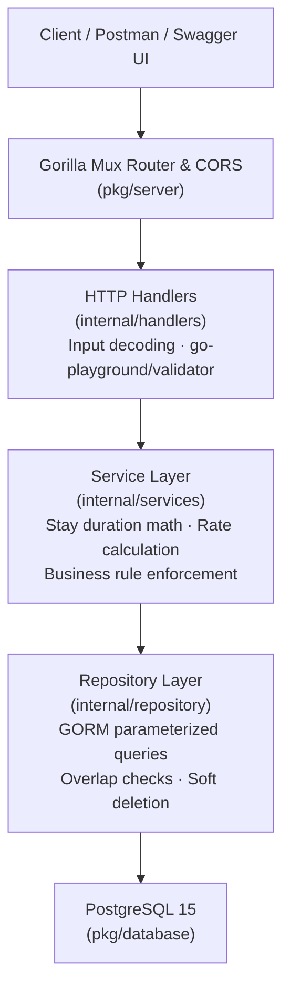

# Hotel Management & Reservation System API

A robust, clean-architecture RESTful API for hotel room reservations, availability querying, stay extensions, and booking management built with **Go 1.23**, **Gorilla Mux**, **GORM**, **PostgreSQL**, and **OpenAPI 3.0**.

---

## Overview

This project demonstrates a production-style layered API that handles the full booking lifecycle for a hotel system:

- **Room catalogue management** — room categories with active/inactive lifecycle
- **Real-time availability querying** — date-range overlap detection prevents double-booking
- **Booking lifecycle** — creation, stay extension, soft-deletion cancellation, and full restoration
- **Automated schema management** — GORM AutoMigrate keeps the database schema in sync with models
- **Interactive API documentation** — embedded Swagger UI / RapiDoc served directly from the binary

---

## Architecture

The application follows a strict layered clean architecture with dependency inversion at every boundary.



**Request/Response envelope** — every response is wrapped in a standard `APIResponse` structure carrying `status`, `code`, `message`, `data`, `errors`, `request_id`, and `timestamp`.

---

## Key Features

| Feature | Detail |
|---|---|
| **Layered Clean Architecture** | Strict Handler → Service → Repository separation with interface-based dependency injection |
| **Date-Range Overlap Querying** | SQL subquery efficiently detects conflicting active bookings preventing double-booking |
| **Information Hiding** | Public API exposes UUIDv4 identifiers; internal joins use high-performance integer primary keys |
| **Comprehensive Validation** | `go-playground/validator/v10` enforces RFC 3339 timestamps, UUIDs, capacity and pagination bounds |
| **Standardised Response Envelope** | Uniform JSON structure with `status`, `code`, `message`, `request_id`, and `timestamp` on every response |
| **Soft Deletion & Restoration** | Bookings are soft-deleted via `is_active` flag with full restoration capability |
| **Interactive API Docs** | OpenAPI 3.0 spec served as dynamic YAML; embedded Swagger UI / RapiDoc UI at `/hotel-output/docs/` |
| **Structured Logging** | Dual-destination Uber Zap logger — structured JSON to stdout and to a rotating log file simultaneously |
| **Containerised** | Multi-stage Docker build + Docker Compose with PostgreSQL 15 and service healthchecks |

---

## Tech Stack

| Layer | Technology |
|---|---|
| Language | Go 1.23 |
| HTTP Router | Gorilla Mux v1.8 |
| ORM | GORM v2 |
| Database | PostgreSQL 15 |
| Logging | Uber Zap v1.28 |
| Validation | go-playground/validator v10 |
| UUID generation | google/uuid v1.4 |
| CORS | rs/cors v1.10 |
| API Specification | OpenAPI 3.0 (Swagger UI / RapiDoc) |
| Testing | testify v1.8 · DATA-DOG/go-sqlmock v1.5 |
| Containerisation | Docker · Docker Compose |

---

## Project Structure

```
hotel-management-system/
├── cmd/
│   └── server/
│       └── main.go              # Entrypoint — parses -env flag, boots server
├── internal/                    # Private application code
│   ├── config/
│   │   └── config.go            # godotenv loader with safe defaults
│   ├── dtos/
│   │   ├── booking_dto.go       # Request & response data transfer objects
│   │   └── response_dto.go      # APIResponse envelope + Error types
│   ├── errorcodes/
│   │   └── error_codes.go       # Domain error codes mapped to HTTP status codes
│   ├── handlers/
│   │   ├── booking_handler.go   # POST /bookings, PUT /extend, PATCH /cancel, PATCH /restore
│   │   ├── room_handler.go      # GET /categories, GET /available
│   │   └── routes.go            # Mux router wiring + OpenAPI/Swagger static serving
│   ├── loggers/
│   │   └── logger.go            # Dual-output Zap logger (stdout JSON + file)
│   ├── models/
│   │   └── models.go            # GORM entities: Guest, RoomCategory, Room, Booking
│   ├── repository/
│   │   ├── booking_repository.go # Data access: guests & bookings CRUD, soft-delete
│   │   └── room_repository.go   # Data access: rooms, categories, overlap queries
│   ├── services/
│   │   ├── booking_service.go   # Booking domain logic: price calc, conflict checks
│   │   └── room_service.go      # Room domain logic: category & availability queries
│   └── utils/
│       └── utils.go             # validator wrapper, date parsers, UUID helpers, response builders
├── pkg/                         # Reusable infrastructure packages
│   ├── database/
│   │   ├── database.go          # GORM PostgreSQL connection
│   │   └── migration.go         # AutoMigrate all models
│   └── server/
│       └── server.go            # App bootstrap, CORS config, router setup, HTTP listener
├── docs/
│   ├── openapi.yaml             # OpenAPI 3.0 specification
│   └── swaggerui/               # Static Swagger UI / RapiDoc assets
├── deployments/
│   ├── Dockerfile               # Multi-stage build (golang:1.23-alpine → alpine)
│   └── docker-compose.yml       # PostgreSQL 15 + API service with healthchecks
├── envs/
│   ├── .env.dev                 # Local dev config (gitignored — never committed)
│   └── .env.example             # Safe template with placeholder values
├── tests/
│   └── unit/
│       ├── config/              # Config loader tests
│       ├── handlers/            # HTTP handler tests (httptest + testify/mock)
│       ├── loggers/             # Logger tests
│       ├── pkg/server/          # Server bootstrap tests
│       ├── repository/          # Repository tests (go-sqlmock)
│       └── services/            # Service logic tests (testify/mock)
├── go.mod
└── go.sum
```

---

## API Endpoints

| Method | Path | Description |
|---|---|---|
| `GET` | `/hotel-output/docs/` | Interactive Swagger UI / RapiDoc documentation |
| `GET` | `/hotel-output/docs/openapi.yaml` | Raw OpenAPI 3.0 specification |
| `GET` | `/api/v1/rooms/categories` | List all active room categories |
| `GET` | `/api/v1/rooms/available` | Query available rooms with filters |
| `POST` | `/api/v1/bookings` | Create a new booking |
| `PUT` | `/api/v1/bookings/extend` | Extend booking checkout date |
| `PATCH` | `/api/v1/bookings/cancel` | Cancel a booking (soft delete) |
| `PATCH` | `/api/v1/bookings/restore` | Restore a cancelled booking |

### Query Parameters — `GET /api/v1/rooms/available`

| Parameter | Type | Required | Description |
|---|---|---|---|
| `check_in` | RFC 3339 datetime | No | Start of desired stay |
| `check_out` | RFC 3339 datetime | No | End of desired stay |
| `room_category_uuid` | UUID v4 | No | Filter by room category |
| `capacity` | positive integer | No | Minimum guest capacity |
| `page` | positive integer | No | Page number (default: 1) |
| `limit` | integer 1–100 | No | Page size (default: 10) |

---

## Example Payloads

### Create Booking — `POST /api/v1/bookings`

**Request:**
```json
{
  "guest": {
    "guest_name": "Jane Smith",
    "age": 32,
    "address": "42 Baker Street, London",
    "phone_number": "+447911123456"
  },
  "room_uuid": "550e8400-e29b-41d4-a716-446655440000",
  "check_in": "2027-03-10T14:00:00Z",
  "check_out": "2027-03-15T11:00:00Z"
}
```

**Response `201 Created`:**
```json
{
  "status": "Success",
  "code": 201,
  "message": "Booking created successfully",
  "data": {
    "booking_uuid": "a1b2c3d4-e5f6-7890-abcd-ef1234567890",
    "guest_uuid": "f0e1d2c3-b4a5-6789-0fed-cba987654321",
    "room_uuid": "550e8400-e29b-41d4-a716-446655440000",
    "room_no": "101",
    "check_in": "2027-03-10T14:00:00Z",
    "check_out": "2027-03-15T11:00:00Z",
    "total_price": 750.00,
    "total_days": 5
  },
  "request_id": "9f8e7d6c-5b4a-3210-fedc-ba9876543210",
  "timestamp": "2026-10-04T10:30:00Z"
}
```

### Extend Booking — `PUT /api/v1/bookings/extend`

**Request:**
```json
{
  "booking_uuid": "a1b2c3d4-e5f6-7890-abcd-ef1234567890",
  "check_out": "2027-03-18T11:00:00Z"
}
```

**Response `200 OK`:**
```json
{
  "status": "Success",
  "code": 200,
  "message": "Booking extended successfully",
  "data": {
    "booking_uuid": "a1b2c3d4-e5f6-7890-abcd-ef1234567890",
    "guest_uuid": "f0e1d2c3-b4a5-6789-0fed-cba987654321",
    "room_uuid": "550e8400-e29b-41d4-a716-446655440000",
    "room_no": "101",
    "check_in": "2027-03-10T14:00:00Z",
    "check_out": "2027-03-18T11:00:00Z",
    "total_price": 1200.00,
    "total_days": 8
  },
  "request_id": "1a2b3c4d-5e6f-7890-abcd-ef0987654321",
  "timestamp": "2026-10-04T11:00:00Z"
}
```

### Cancel Booking — `PATCH /api/v1/bookings/cancel`

**Request:**
```json
{
  "booking_uuid": "a1b2c3d4-e5f6-7890-abcd-ef1234567890"
}
```

**Response `200 OK`:**
```json
{
  "status": "Success",
  "code": 200,
  "message": "Booking cancelled successfully",
  "data": { "message": "Booking cancelled" },
  "request_id": "...",
  "timestamp": "..."
}
```

---

## Getting Started

### Prerequisites

- **Go 1.23+** — [golang.org/dl](https://golang.org/dl/)
- **PostgreSQL 15+** — or use Docker Compose (recommended)
- **Docker & Docker Compose** — for containerised setup

---

### Option A — Run with Docker Compose (recommended)

```bash
git clone https://github.com/your-username/hotel-management-system-api.git
cd hotel-management-system-api

docker compose -f deployments/docker-compose.yml up --build
```

The API starts at `http://localhost:8080` and PostgreSQL is provisioned automatically.  
Docker Compose waits for the database healthcheck before starting the API.

---

### Option B — Run Locally

**1. Clone and install dependencies:**
```bash
git clone https://github.com/your-username/hotel-management-system-api.git
cd hotel-management-system-api
go mod download
```

**2. Create a local environment file:**
```bash
cp envs/.env.example envs/.env.dev
# Edit envs/.env.dev with your local PostgreSQL credentials
```

**3. Start PostgreSQL** (adjust credentials to match your `.env.dev`).

**4. Run the server:**
```bash
go run cmd/server/main.go -env dev
```

**5. Access the API and docs:**

| URL | Description |
|---|---|
| `http://localhost:8080/hotel-output/docs/` | Interactive Swagger UI |
| `http://localhost:8080/hotel-output/docs/openapi.yaml` | Raw OpenAPI spec |
| `http://localhost:8080/api/v1/rooms/categories` | Sample API call |

---

## Running Tests

Run the full test suite (no database required — all tests use `go-sqlmock` or `testify/mock`):

```bash
go test ./...
```

Run with verbose output:
```bash
go test -v ./...
```

Generate an HTML coverage report:
```bash
go test -coverprofile=coverage.out ./...
go tool cover -html=coverage.out -o coverage.html
open coverage.html
```

---

## Engineering & Design Decisions

### UUIDs for Public API, Integer IDs for Database Joins

Exposing sequential integer primary keys in a public API leaks record counts and enables enumeration attacks. This API surfaces UUIDv4 identifiers (`booking_uuid`, `room_uuid`, `guest_uuid`) in all responses and requests, while internal GORM joins use integer primary keys for index performance. The UUID–to–ID lookup happens in the repository layer and is never surfaced externally.

### Interface-Based Dependency Injection

Every layer boundary is defined by a Go interface (`BookingServiceInterface`, `RoomServiceInterface`, `BookingRepositoryInterface`, `RoomRepositoryInterface`). This means:

- Unit tests replace real implementations with `testify/mock` mocks without any live database
- The service layer has no knowledge of how data is stored
- Swapping the database driver or adding a caching layer requires no changes upstream

### Centralised Error Code Mapping

Domain errors use typed string constants (`HMS_REC_404`, `HMS_DB_001`, `HMS_CONFLICT_409`, etc.) defined in `internal/errorcodes`. A single `MapErrorCode` utility function translates these to HTTP status codes. This means business logic never reaches for `net/http` status constants directly, keeping the domain layer transport-agnostic.

### Soft Deletion

Bookings are never hard-deleted. Setting `is_active = false` preserves audit history and allows full restoration via `PATCH /api/v1/bookings/restore`. The overlap query explicitly filters `WHERE is_active = true` so cancelled bookings free up their room dates.

---

## Roadmap / Future Enhancements

- **Concurrency protection** — database-level row locking (`SELECT FOR UPDATE`) or optimistic locking to prevent race conditions under concurrent booking requests
- **JWT Authentication & RBAC** — per-role access control separating Guest operations from Hotel Admin operations
- **Payment gateway integration** — Stripe or PayPal for booking deposits and full payment processing
- **Redis caching** — cache room category listings and availability results with TTL invalidation
- **Refresh token rotation** — stateless auth with short-lived access tokens and rotating refresh tokens
- **Integration test suite** — Docker-based test containers running against a real PostgreSQL instance

---

